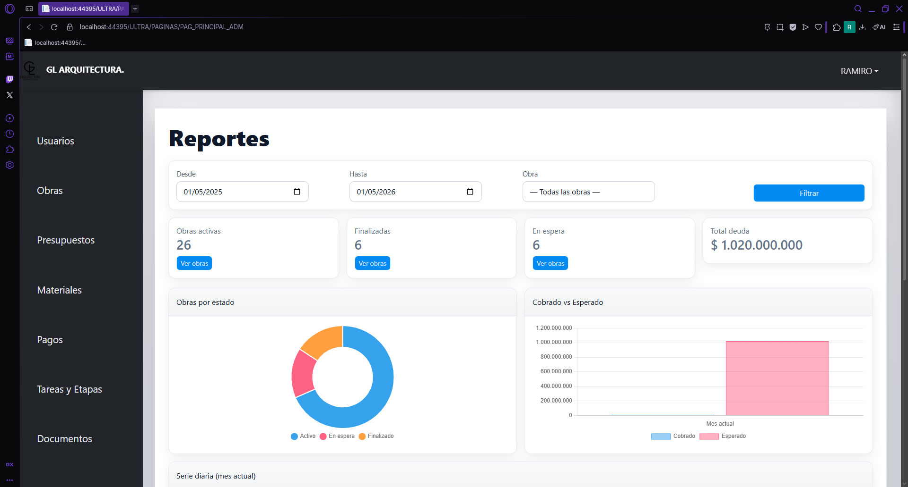
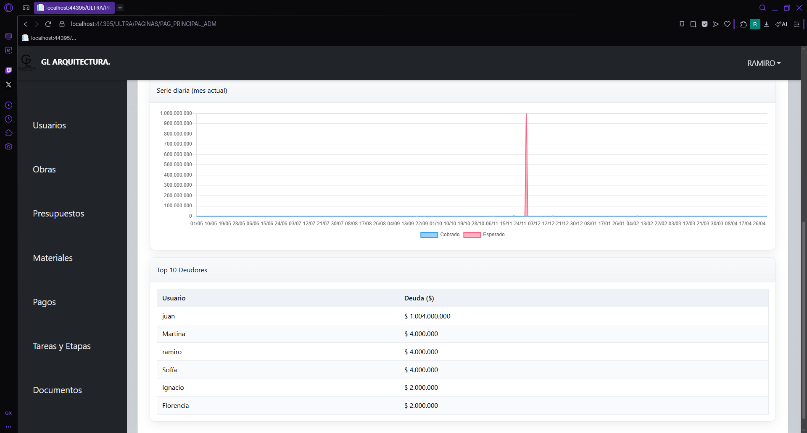
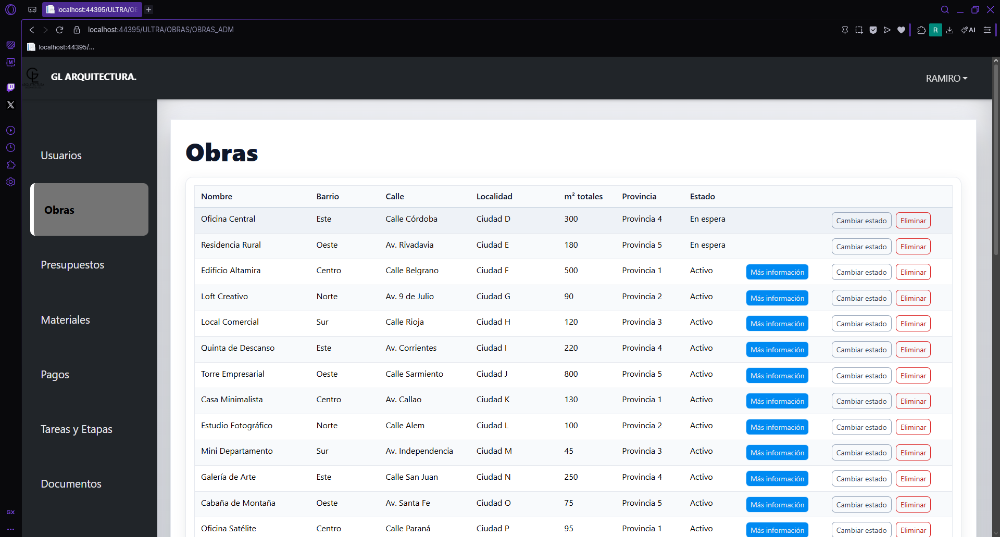
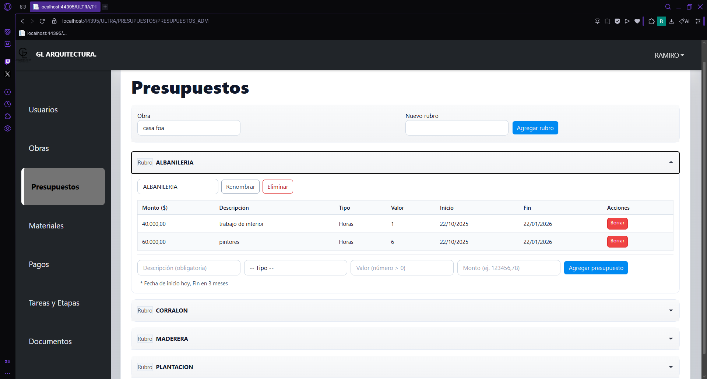
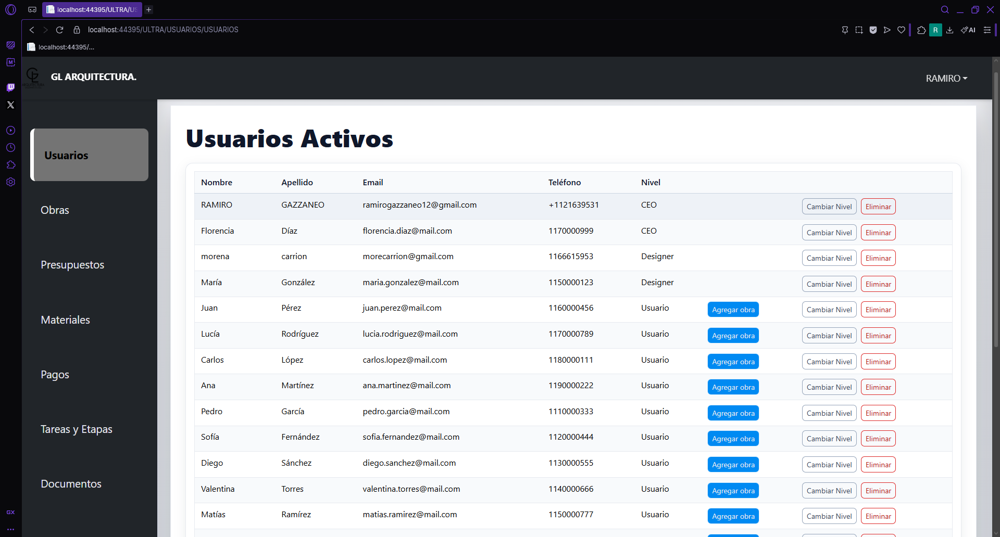

\ Sistema web de gestión administrativa para estudios de arquitectura desarrollado con ASP.NET WebForms, C#, js y SQL Server.






\ Descripción


Este proyecto desarrolla un sistema web de gestión administrativa para estudios de arquitectura, diseñado para centralizar la información y mejorar la organización de los proyectos.


El sistema integra en una sola plataforma la gestión de obras, presupuestos, tareas, documentación técnica y administración financiera, permitiendo un seguimiento más eficiente del estado de cada proyecto.


El objetivo principal es optimizar la gestión interna del estudio, facilitando la planificación, el control de recursos y la toma de decisiones.


---


\ Funcionalidades principales


Gestión de obras y proyectos

Administración de presupuestos

Control de tareas y etapas de obra

Gestión de usuarios del sistema

Registro de pagos y movimientos financieros

Administración de materiales

Gestión de documentación técnica

Visualización de reportes y métricas


---


\ Tecnologías utilizadas


El sistema fue desarrollado utilizando las siguientes tecnologías:


ASP.NET WebForms

C#

SQL Server

HTML5

CSS3

Bootstrap

JavaScript


---


\ Arquitectura del sistema


El proyecto sigue una \*\*arquitectura en capas\*\*, separando responsabilidades para facilitar el mantenimiento y la escalabilidad del sistema.


\ Capa de presentación


Interfaz web desarrollada con ASP.NET WebForms, encargada de la interacción con el usuario.


\ Capa de lógica de negocio


Implementada en el módulo \*\*BIZ\*\*, donde se gestionan las reglas del sistema y la comunicación entre la interfaz y la base de datos.


\ Capa de datos


Base de datos relacional en \*\*SQL Server\*\*, donde se almacenan todos los registros del sistema.


---


\ Base de datos


El sistema utiliza \*\*SQL Server\*\* como motor de base de datos.


\ Tablas principales


\* Obras

\* Presupuestos

\* Usuarios

\* Materiales

\* Pagos

\* TareasEtapas

\* Documentos


Estas tablas permiten organizar la información del estudio y mantener el seguimiento completo de cada proyecto.


---


\ Instalación


Para ejecutar el proyecto en un entorno local:


1\. Clonar el repositorio


```bash

git clone https://github.com/ramirogazzaneo/gl-arquitectura.git

```


2\. Abrir la solución en \*\*Visual Studio\*\*


3\. Restaurar la base de datos en \*\*SQL Server\*\*


\ Configuración de base de datos


3.1. Crear una base de datos en SQL Server llamada:


GLarquitectura


3.2. Ejecutar el script ubicado en:


/database/GLarquitectura.sql


3.3. Configurar la cadena de conexión a la base de datos en el archivo::


Web.config


5\. Ejecutar el proyecto desde \*\*Visual Studio\*\*


---


\ Vista del sistema


\ Dashboard


El dashboard centraliza información clave del sistema, mostrando indicadores sobre obras activas, estado de proyectos y métricas administrativas.


---


\ Gestión de obras





Permite registrar, editar y administrar las distintas obras gestionadas por el estudio.


---


\ Presupuestos





Módulo destinado a la creación y gestión de presupuestos asociados a cada proyecto.


---


\ Gestión de usuarios





Permite administrar los usuarios del sistema y definir sus permisos de acceso.


---


\ Objetivo académico


Este sistema fue desarrollado como parte de un \*\*proyecto académico\*\*, con el objetivo de integrar conocimientos de desarrollo web, gestión de bases de datos y arquitectura de software aplicados a una solución real para estudios de arquitectura.


---


\Autor


Ramiro Gazzaneo


Proyecto académico — Seminario de Integración

